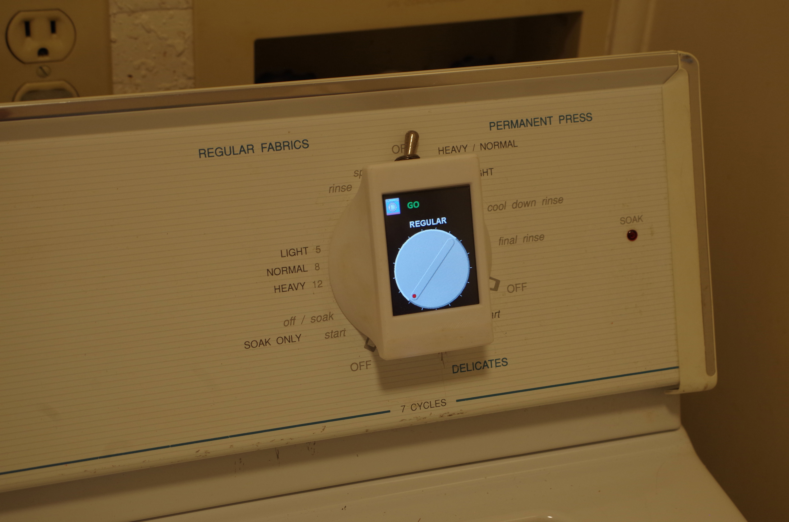
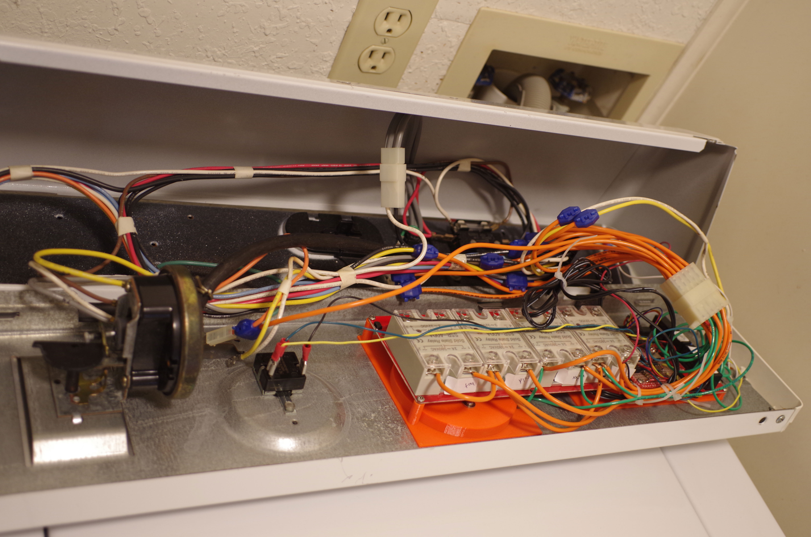
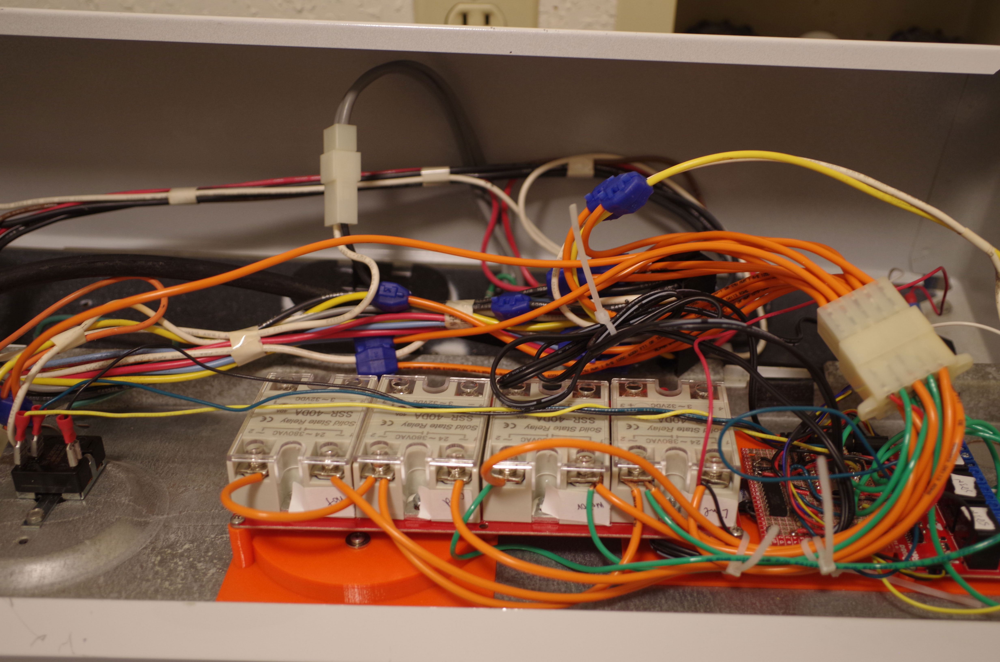
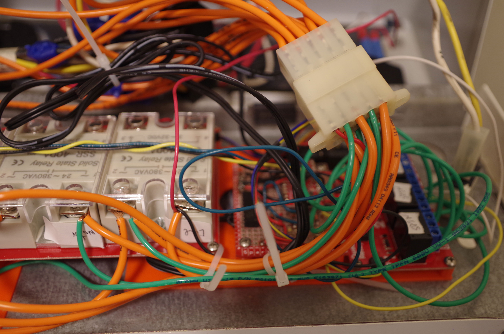

Maytag LAT8504 Washing machine timer replacement

This repository documents a project that replaces the failed timer on my Maytag washing machine. Maybe there is
enough detail here to duplicate this project, and maybe the parts are even available. There is no particular
reason to use the exact parts I specify here, especially for the relays, but note that K1 and K2 must 
support full motor current, which is specified as 7.5A.

 A few parts, mostly from Sparkfun, can be assembled to replace the timer in the Maytag LAT8504. All these
 parts together cost me less than half the cost of an exact replacement mechanical timer.
 <ul>
 <li> <a href='https://www.sparkfun.com/products/15795'>Qwiic Pro Micro USB-C</a></li>
 <li><a href='https://www.sparkfun.com/products/16566'>Qwiic Quad relay</a> for the qwiic
version of the agitate/spin/soak relay. Or one each of the ANMBEST single and dual 5V coil relays, part ANMBEST_MD314-319 that I 
got off amazon. The later is called "per pin" or "perPin" in the ino and STL. </li>
 <li><a href='https://www.sparkfun.com/products/16833'>Qwiic Quad Solid state relay kit</a></li>
 <li>Two opto isolators are also required, along with a 100K 1/4W resistor for each. A reverse diode is required
 as shown if the opto isolator is unidirectional. Do not omit the 2.7K resistor across 
the opto-isolator LED! It is required to prevent false positive signals to the Arduino for both tub full and
lid closed.
 <li><a href='https://4dsystems.com.au/gen4-ulcd-24pt'>4D systems GEN4-ULCD-24PT</a>
 </ul>

 Four plastic pieces are needed to mount everything. 3D printable STL files are in the stl 
 directory.

 None of the original wires in the washer are cut, nor is the connector for the timer removed. To
 restore the original timer:
<ul><li>The 
 spade lugs at the water temperature switch need to be restored to their original connections
<li>The spade lugs at the water level switch need to be resotred to their original connections (taking
care that the added tap to the Neutral wire is tied down and insulated from connecting to anything.
<li>the 
MOLEX connector for this
 device unplugged
<li> the 3D printed plastic parts around the original timer hole removed
<li> the
 original timer installed and plugged into its original connector. The original connector is
 not plainly visible in the photos below, but its there along with all the wires connected to
 it.
</ul>
The Arduino Pro Micro is soldered to a slightly larger breadboard along with the optoisolators,
 associated resistors, and the 5 pin header for the LCD screen. The circuit diagram is
 here: <a href='Maytag Timer ugrade.pdf'>Maytag Timer ugrade.pdf</a>.

 Photos:
 

